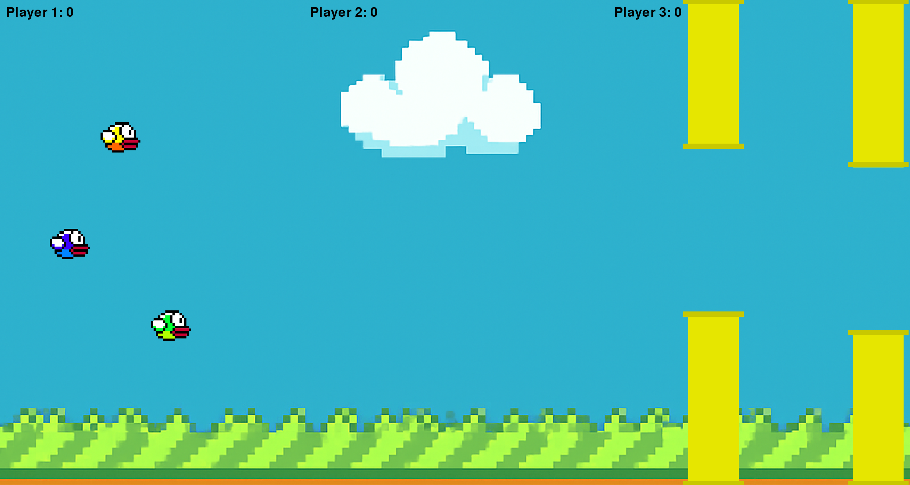
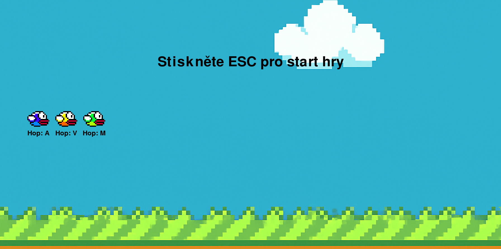
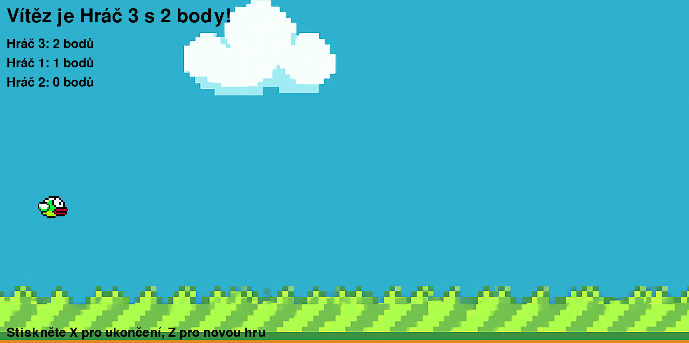

# Flapperbirds3



**Flapperbirds3** je návyková multiplayerová arkádová hra inspirovaná klasickou hrou Flappy Bird, kde tři hráči soutěží o nejvyšší skóre prolétáváním mezi trubkami na jedné klávesnici!

[](https://opensource.org/licenses/MIT)
[](https://www.python.org/downloads/)
[](https://www.pygame.org/)

## 📖 Popis

Ve hře Flapperbirds3 ovládáte jednoho ze tří ptáků, kteří se snaží vyhnout trubkám a získat co nejvyšší skóre. Každý hráč má svou klávesu pro skok (A, V, M), a cílem je přežít co nejdéle. Hra kombinuje jednoduché ovládání s intenzivní soutěžní atmosférou, díky čemuž je ideální pro herní večery s přáteli. Po skončení hry se zobrazí leaderboard s vítězem!

## 🎮 Hlavní vlastnosti

- **Multiplayer**: Až tři hráči na jedné klávesnici.
- **Jednoduché ovládání**: Skok klávesami A, V, M.
- **Dynamické překážky**: Náhodně generované trubky.
- **Responzivní design**: Podpora různých rozlišení obrazovky.
- **Leaderboard**: Vyhlášení vítěze po každé hře.
- **Pauza a fullscreen**: Pohodlné ovládání hry.

## 🛠️ Instalace

1. **Nainstalujte Python 3.8+**: Stáhněte z [python.org](https://www.python.org/downloads/).
2. **Nainstalujte Pygame**: Spusťte v terminálu:
   ```bash
   pip install pygame
   ```
3. **Stáhněte repozitář**:
   - Klikněte na tlačítko "Code" a stáhněte ZIP, nebo použijte:
     ```bash
     git clone https://github.com/username/flapperbirds3.git
     ```
4. **Zkontrolujte obrázky**: Ujistěte se, že v adresáři hry jsou soubory:
   - `background.png`
   - `player1.png`
   - `player2.png`
   - `player3.png`
   (Pokud chybí, nahrajte placeholder obrázky z adresáře.)

## 🚀 Spuštění hry

1. Přejděte do adresáře hry:
   ```bash
   cd flapperbirds3
   ```
2. Spusťte hru:
   ```bash
   python flapperbirds3.py
   ```
3. Stiskněte **Esc** pro zahájení hry.

## 🎮 Ovládání

| Akce              | Klávesa          |
|-------------------|------------------|
| Hráč 1 – Skok     | **A**            |
| Hráč 2 – Skok     | **V**            |
| Hráč 3 – Skok     | **M**            |
| Pauza             | **Esc**          |
| Fullscreen        | **Alt + Enter**  |
| Nová hra (po prohře) | **Z**         |
| Ukončení (po prohře) | **X**         |

## 🖥️ Požadavky

- **Operační systém**: Windows 10+, MacOS 10.13+, Linux (Ubuntu 18.04+).
- **Python**: Verze 3.8 nebo vyšší.
- **Pygame**: Verze 2.0.0 nebo vyšší.
- **Tkinter**: Součást standardní instalace Pythonu.
- **Doporučené rozlišení**: 1800x900 (minimálně 400x300).

## 📸 Screenshoty




## 🔗 Odkazy

- **Stáhněte hru**: [GitHub Releases](https://github.com/VitaPhoneCZ/FlapperBirds3/releases/)

## 🙏 Poděkování

Děkujeme všem, kdo hru vyzkoušeli a poskytli zpětnou vazbu! Inspirací nám byla klasická hra Flappy Bird a komunita open-source vývojářů.

---
**Tým FVPV**  ¨

⭐ **Líbí se vám Flapperbirds3? Dejte nám hvězdičku na GitHubu!** ⭐
